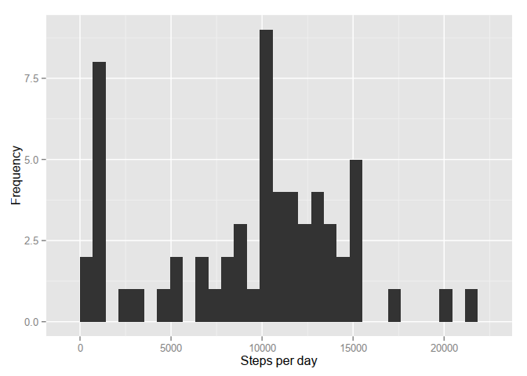

# Reproducible Research: Peer Assessment 1

##Assignment 1
This paper shall answer the questions proposed by the peer assesment number one. First of all, the activity monitoring dataset shall be downloaded and extracted.


```r
library(ggplot2)
library(dplyr)
```

```
## 
## Attaching package: 'dplyr'
## 
## The following object is masked from 'package:stats':
## 
##     filter
## 
## The following objects are masked from 'package:base':
## 
##     intersect, setdiff, setequal, union
```

```r
setwd("~/R/reproducible_research/RepData_PeerAssessment1")
download.file("https://d396qusza40orc.cloudfront.net/repdata%2Fdata%2Factivity.zip", destfile = "actv_mon_data.zip", method = "curl")
unzip(zipfile = "actv_mon_data.zip")
actv <- read.csv(file = "activity.csv")
steps_per_day <- actv %>% group_by(date) %>% summarise(sum_steps = sum(steps,na.rm = TRUE))
spd_mean <- mean(steps_per_day$sum_steps)
spd_median <- median(steps_per_day$sum_steps)
```
###What is mean total number of steps taken per day?
Presented below is the histogram of the total number of steps taken each day:

```r
qplot(sum_steps, data = steps_per_day, xlab = "Steps per Day", ylab = "Frequency")
```

 

Presenting the **mean** of 9354.2295082 and the **median** of 10395 for such distribution.

###What is the average daily activity pattern?
The next graphic shows the daily activity pattern of all days measured averaged by each time interval.

```r
daily_pat_mean <- actv %>% group_by(interval) %>% summarise(ave_n_steps = mean(steps,na.rm = TRUE))
daily_pat_median <- actv %>% group_by(interval) %>% summarise(med_n_steps = median(steps,na.rm = TRUE))
max_ave_steps_int <- daily_pat_mean$interval[which.max(daily_pat_mean$ave_n_steps)]
qplot(interval, ave_n_steps, data = daily_pat_mean, geom = "line", xlab = "Intervals", ylab = "Averaged Steps per Day")
```

 

The interval which had the greatest average of steps per day was 835.

###Inputing missing values
To minimize the bias due to the presence of NA's in the data, these values will be fullfilled by the median of the distribution of the steps taken in that interval each day.

```r
n_na <- sum(is.na(actv$steps))
```
The total number of missing values is 2304.


```r
actv_rev <- actv
for (n in 1:length(actv$steps)) {
  if (is.na(actv_rev$steps[n])) {
    actv_rev$steps[n] <- daily_pat_median$med_n_steps[daily_pat_median$interval == actv_rev$interval[n]]
  }
}
steps_per_day_rev <- actv_rev %>% group_by(date) %>% summarise(steps_per_day = sum(steps))
spd_mean_rev <- mean(steps_per_day_rev$steps_per_day)
spd_median_rev <- median(steps_per_day_rev$steps_per_day)
```
The graphics below shows the histogram of the total number of steps per day for the filled dataset:


```r
qplot(steps_per_day, data = steps_per_day_rev, geom = "histogram", xlab = "Steps per day", ylab = "Frequency")
```

 

This distribution has a **mean** of 9503.8688525 and a **median** of 10395. The **mean** has slightly increased (1.015997 times) with respect to the value found in the first part. This is due to the insertion of positive values where there were none, increasing the total number os steps "taken" each day. The median, though, found no change inits value. 

###Are there differences in activity patterns between weekdays and weekends?

```r
actv_rev$day_type <- weekdays(as.POSIXct(actv_rev$date, tz = "GMT"))
actv_rev$day_type <- ifelse(actv_rev$day_type %in% c("sábado", "domingo"), "weekend", "weekday")
spd_ave_wday <- actv_rev %>% group_by(day_type, interval) %>% summarise(ave_spd = mean(steps))
qplot(interval, ave_spd, data = spd_ave_wday, geom = "line", facets = day_type ~ ., xlab = "Interval", ylab = "Number of steps")
```

 

During the weekdays, people tend to walk more in the beggining of the days.
